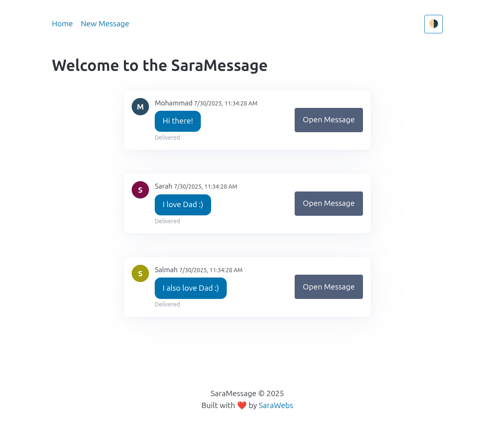
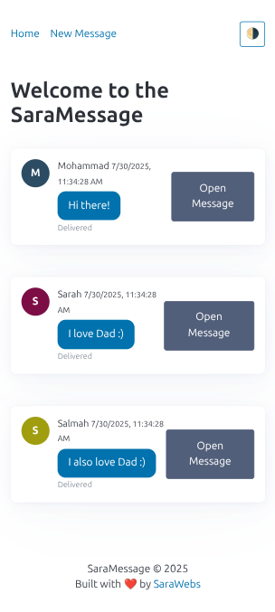

# 📨 Top Basic Messageboard

A simple messageboard built using **Node.js**, **Express**, and **EJS**.
Users can view existing messages, submit new ones, and view message details.

[Code at GitHub](https://github.com/mdahamshi/top-basic-message)

[Live DEMO](https://link.dahamshi.xyz/top-basic-message)


## 🚀 Features

* View all messages on the homepage (`/`)
* Submit a new message via a form (`/new`)
* See message details on a dedicated page (`/messages/:id`)
* Delete message by id (`/messages/:id/delete`)
* Server-side rendering using EJS templating engine


## 🛠️ Installation & Setup

```bash
git clone https://github.com/mdahamshi/top-basic-message.git
cd top-basic-message
npm install
npm start
```

Visit your app at [http://localhost:3000](http://localhost:3000)

## ✏️ Adding a Message

1. Go to `/new`
2. Fill in your **name** and **message**
3. Submit the form
4. You’ll be redirected back to the homepage and see your new message!

## 🧠 Built With

* [Node.js](https://nodejs.org/)
* [Express](https://expressjs.com/)
* [EJS](https://ejs.co/)

## 📸 Screenshots





## 📦 Future Features

* Persist messages to a database (e.g. MongoDB)
* Add message deletion and editing
* Use flash messages or validations
* Deploy to a platform like Render, Vercel, or Railway

## 📄 License

MIT License
